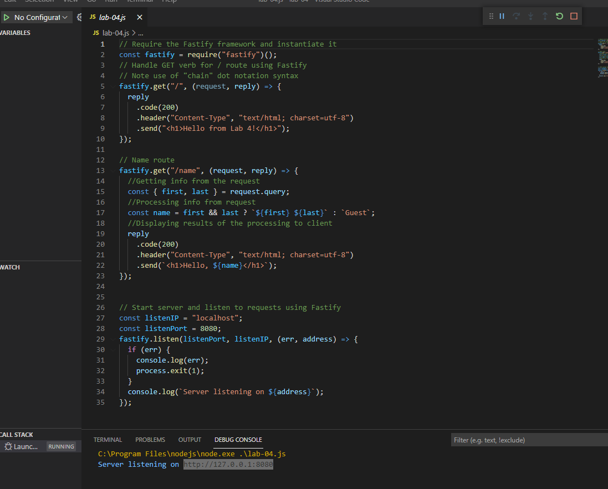
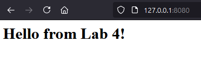

# Welcome to the Cit 281 Lab 4 Page

### What I learned:

- Introduced to Fastify Node.js web servers.
- Learned how to initialize a Node.js project folder using Node Package Manager (NPM)
- Learned how to run a web server on Visual Studio Code 

### Purpose of Lab:

- This lab introduced us to Fastify web servers using Node.js
- We were able to create a folder using Windows Prompt and NPM to create files to support the web server.
- We also learned how to properly code a web server using the JS language
- We learned how to run the server using run & debug.
- We also learned how to utilize query perameters in routes to effect outputs. 
- Lastly, we were able to load up the page on our browser using the correct route

### Outcome pics: 

### [**Back to home page**](https://uo-cit-itsbread33.github.io/ItsBread33.github.io/)

